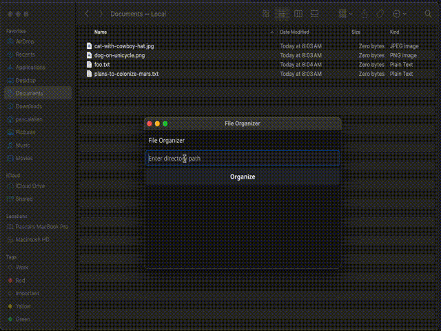

# File Organizer


[](https://goreportcard.com/report/github.com/pascalallen/file-organizer)


**File Organizer** is a desktop and CLI application that organizes your files into directories based on their file 
extensions. Available for macOS, Linux, and Windows, it provides an intuitive way to keep your files neatly categorized.

## Features

- Simple installation process.
- Automatically organizes files by their extensions.
- Dynamically creates folders for each unique file extension.
- Allows users to specify the directory to organize through a graphical user interface or a command line interface.

## Example

### Before

```bash
/path/to/your/directory/
├── document1.txt
├── image1.jpg
├── script.go
└── notes.txt
```

### After

```bash
/path/to/your/directory/
├── go/
│   └── script.go
├── jpg/
│   └── image1.jpg
└── txt/
    ├── document1.txt
    └── notes.txt
```

## Download the CLI tool

Choose the version of File Organizer for your operating system:

- [Download for Linux](https://github.com/pascalallen/file-organizer/releases/download/v1.0.0/file-organizer-linux)
- [Download for macOS](https://github.com/pascalallen/file-organizer/releases/download/v1.0.0/file-organizer-macos)
- [Download for Windows](https://github.com/pascalallen/file-organizer/releases/download/v1.0.0/file-organizer-windows.exe)

### Usage

Once downloaded, you can run the program from the command line, specifying the directory you want to organize.

#### Linux/macOS:

```bash
./file-organizer-macos /path/to/your/directory
```

#### Windows

```bash
file-organizer-windows.exe C:\path\to\your\directory
```

## Download the desktop app

Choose the version of File Organizer for your operating system:

- [Download for Linux](https://github.com/pascalallen/file-organizer/releases/download/v2.0.0/File.Organizer.tar.xz)
- [Download for macOS](https://github.com/pascalallen/file-organizer/releases/download/v2.0.0/File.Organizer.app.zip)
- [Download for Windows](https://github.com/pascalallen/file-organizer/releases/download/v2.0.0/File.Organizer.zip)

### Usage

After downloading and installing, simply open the app. You can select the directory you want to organize through the 
app’s interface. For macOS users: Move the downloaded File Organizer app to your /Applications directory for ease of 
access.

